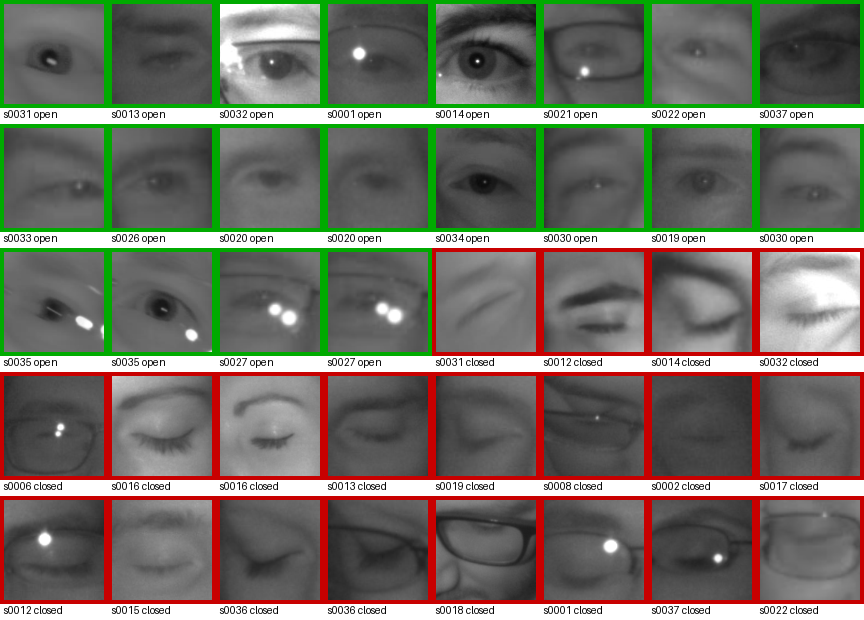

# Driver Drowsiness Detection



Digital Image Processing mini project — Week 1: dataset survey, curated samples, and
project proposal.

## Team

| Name | Roll Number |
|---|---|
| Amey Pawar | 23108B0057 |
| Sejal Andhale | 23108B0049 |

## Problem Statement

Driver fatigue is a leading contributor to road accidents, and most vehicles lack any
onboard mechanism to detect drowsiness before it causes a crash. This project builds a
vision-based driver drowsiness detection system: an eye-state classifier trained on the MRL
Eye Dataset, combined with live-video EAR/MAR and PERCLOS tracking at inference time, to
raise a timely fatigue alert. See `docs/literature_survey.md` for the full existing-solutions
and research-gap analysis.

## Objectives

- Curate and characterize the MRL Eye Dataset for eye-state classification.
- Design an enhancement front-end (CLAHE, gamma, glare suppression) for low-light/IR crops.
- Segment sclera/iris/pupil regions and clean masks via morphological operations.
- Apply DFT/DCT transforms for blur rejection and Hough-circle iris fitting.
- Implement adaptive-threshold EAR/MAR and PERCLOS at inference time on live video.
- Quantify JPEG/DCT compression trade-offs for in-vehicle frame transmission.

## DIP Topic Coverage

| DIP Topic | Pipeline Stage |
|---|---|
| Image enhancement | CLAHE + gamma correction on low-light IR eye crops; reflection suppression for eyeglasses |
| Segmentation | Sclera/iris/pupil isolation via adaptive + Otsu thresholding |
| Morphological ops | Opening/closing to clean eye mask; hole-filling before area measurement |
| Transforms | DFT/DCT for blur & motion detection; Hough circle transform for iris fitting |
| Image compression | DCT/JPEG quality sweep quantifying accuracy-vs-bitrate for in-vehicle transmission |

Full mapping with concrete OpenCV/scikit-image function calls: `docs/dip_topic_mapping.md`.

## Dataset

**MRL Eye Dataset**, VSB — Technical University of Ostrava
(https://mrl.cs.vsb.cz/data/eyedataset/): 84,898 grayscale infrared eye-crop images, 37
subjects. A curated, balanced 40-image sample (20 alert / 20 drowsy eye-state) plus a
manifest is checked into `data/samples/` for Week-1 exploration — see
`data/samples/README.md` for provenance, per-image metadata, and dataset license/usage
terms.

## Repository Structure

```
.
├── data/
│   ├── raw/mrlEyes_2018_01/   # full extracted MRL dataset (gitignored)
│   ├── processed/             # intermediate outputs (gitignored)
│   └── samples/               # curated 40-image sample + manifest.csv
│       ├── alert/
│       ├── drowsy/
│       ├── manifest.csv
│       └── README.md
├── docs/
│   ├── literature_survey.md
│   ├── dip_topic_mapping.md
│   ├── roadmap.md
│   └── proposal/
│       ├── proposal.html
│       └── DIP_Proposal_Drowsiness_Detection.pdf
├── notebooks/                  # exploratory analysis notebooks
├── results/
│   └── week1_sample_grid.png
├── scripts/
│   ├── extract_dataset.sh
│   ├── curate_samples.py
│   └── make_proposal_pdf.sh
├── src/                        # future weeks: preprocess.py, ear.py, detect.py, perclos.py
├── requirements.txt
└── LICENSE
```

## Setup / Reproduce

```bash
python3.11 -m venv .venv
source .venv/bin/activate
pip install -r requirements.txt

# extract dataset (already run for this checkout)
bash scripts/extract_dataset.sh

# regenerate the curated sample set + manifest + grid
python scripts/curate_samples.py

# regenerate the proposal PDF (headless Chrome, 2-page max, verified)
bash scripts/make_proposal_pdf.sh
```

## Roadmap

| Week | Focus | Status |
|---|---|---|
| 1 | Survey, dataset curation, proposal | [x] |
| 2 | Image enhancement + image-size normalization | [ ] |
| 3 | Segmentation (adaptive/Otsu thresholding) | [ ] |
| 4 | Morphological operations | [ ] |
| 5 | Transforms (DFT/DCT, Hough) + self-recorded PERCLOS clip | [ ] |
| 6 | Eye-state classifier training on MRL | [ ] |
| 7 | Live inference: EAR/MAR + PERCLOS | [ ] |
| 8 | Compression sweep + final integration | [ ] |

Full detail: `docs/roadmap.md`.

## Deliverables

- Project proposal (2 pages): [`docs/proposal/DIP_Proposal_Drowsiness_Detection.pdf`](docs/proposal/DIP_Proposal_Drowsiness_Detection.pdf)
- Literature survey: `docs/literature_survey.md`
- DIP topic mapping: `docs/dip_topic_mapping.md`
- Roadmap: `docs/roadmap.md`
- Curated sample dataset + grid visualization: `data/samples/`, `results/week1_sample_grid.png`

## References

See `docs/literature_survey.md` for the full numbered reference list (PERCLOS, EAR/MAR,
PyImageSearch and GitHub reference implementations, CNN/transformer papers, commercial DMS
systems, EU GSR regulation, MRL Eye Dataset).

## License / Attribution

Code in this repository is MIT-licensed — see `LICENSE`. The license covers code only; it
does not grant rights to the MRL Eye Dataset. Dataset terms and attribution are documented in
`data/samples/README.md`.
