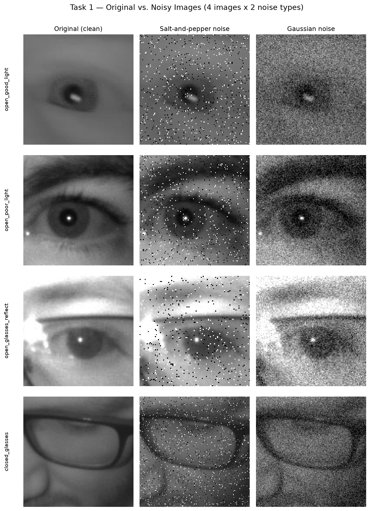
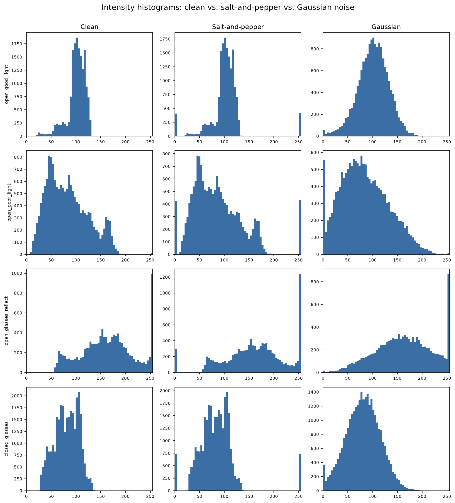
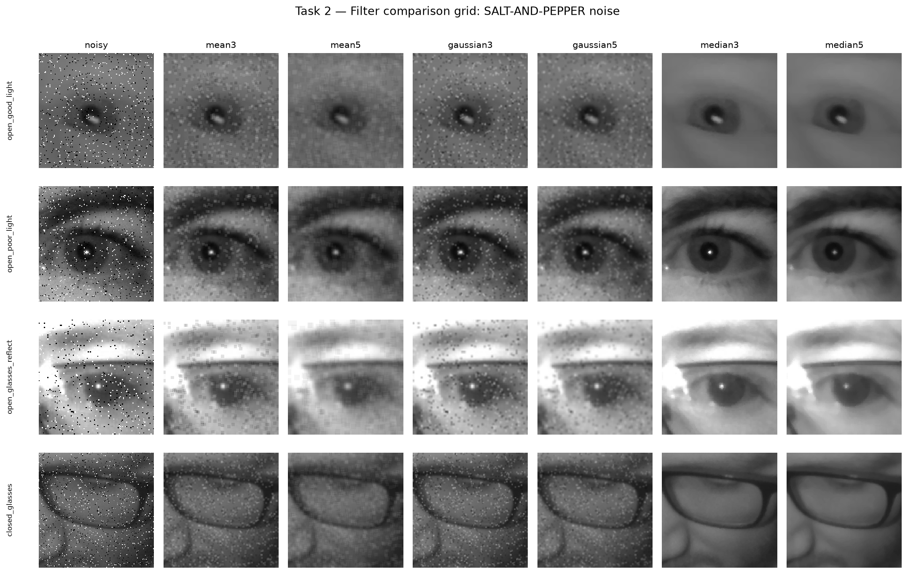
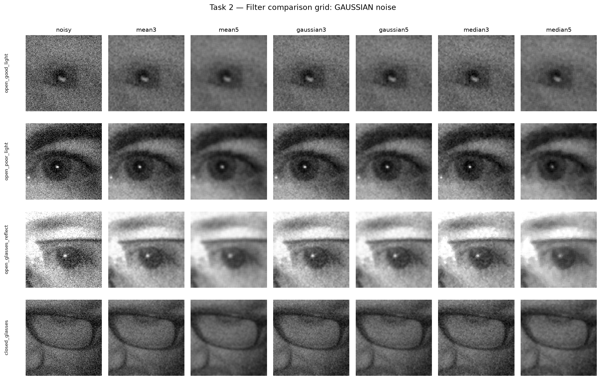
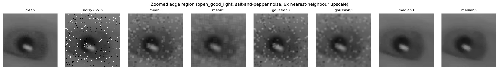
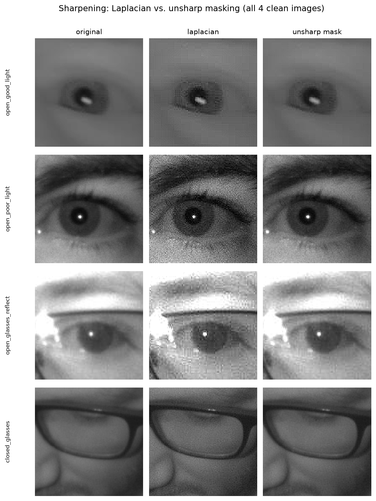
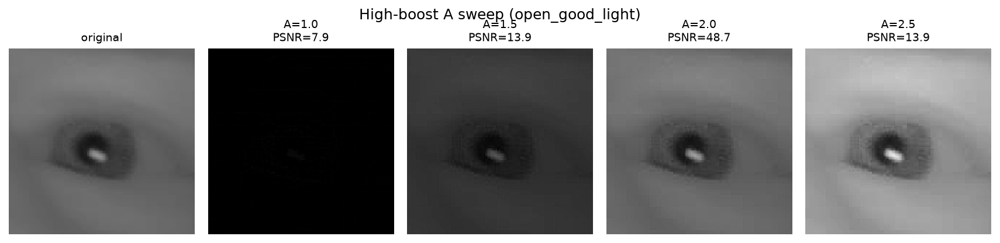
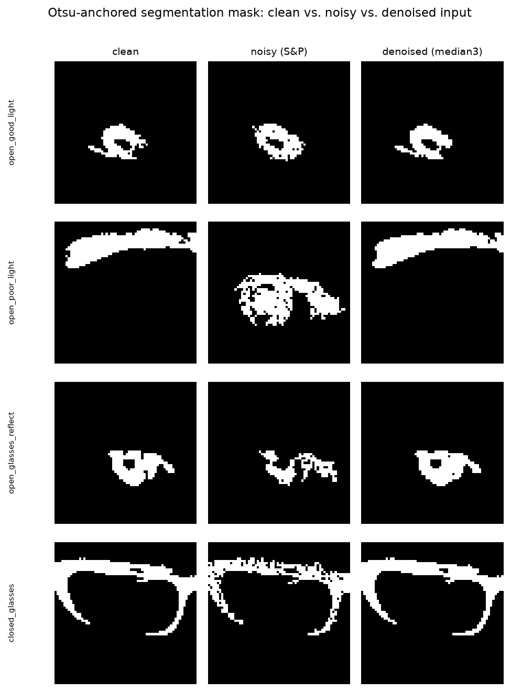

# Task 4 — Spatial Domain Filtering (Smoothing and Sharpening)

Digital Image Processing mini project: Driver Drowsiness Detection.
Amey Pawar (23108B0057), Sejal Andhale (23108B0049).

Full evidence (all figures, the metric tables, observation prose throughout) is in
`notebooks/09_spatial_filtering.ipynb`, executed top-to-bottom with stored outputs. This
document is the condensed, submission-ready write-up. All filter/noise/metric code lives in
`src/spatial_filtering.py` (imported per notebook cell, never reimplemented inline).
Segmentation reuses `src.segment` / `src.preprocess` (Week 3 / Week 2) unmodified.

## The task

Extend the pipeline with a spatial-domain filtering module: apply smoothing and sharpening
filters to improve image quality, reduce noise, and enhance detail, so that this module's
output becomes an improved input for the segmentation module developed in earlier weeks. The
syllabus names smoothing filters, sharpening filters, and high-boost filtering; the practical
component asks for analysis of noise reduction, edge preservation, and image quality.

## Images used

Four images from `data/samples/` (the 40-image curated MRL Eye Dataset subset), chosen to span
genuinely different acquisition conditions rather than a single favourable case, and preferring
the physically larger crops so filter effects are visible pixel-for-pixel:

| Name | File | Condition | Size |
|---|---|---|---|
| `open_good_light` | `alert/s0031_00366_1_0_1_0_1_02.png` | open, no glasses, good lighting | 128x128 |
| `open_poor_light` | `alert/s0014_08297_0_0_1_1_0_02.png` | open, no glasses, poor lighting | 130x130 |
| `open_glasses_reflect` | `alert/s0032_02096_0_1_1_2_1_02.png` | open, eyeglasses + high IR reflection | 108x108 |
| `closed_glasses` | `drowsy/s0018_02225_0_1_0_0_0_01.png` | **closed** eye, glasses, poor lighting | 172x172 (largest closed-eye crop in the sample set) |

These are grayscale near-infrared eye crops, modest in size (55-297px across the full curated
sample, median 87px). Even this "largest crops" subset tops out at 172px, so a 5x5 filter
kernel covers a proportionally much larger fraction of the frame than it would on a
full-resolution photo — this is directly relevant to the blurring results in Task 2.

## Methods

**Noise injection** (`src.spatial_filtering.add_salt_pepper_noise`, `add_gaussian_noise`), both
seeded `seed=0`:
- **Salt-and-pepper**: `amount=0.05` (5% of pixels replaced), 50/50 salt/pepper split.
- **Gaussian**: `mean=0, sigma=25` (0-255 intensity units), clipped to [0,255].

One noise level per type was used (not a full parameter sweep), chosen so degradation is
clearly visible without destroying the underlying eye structure — both baselines land around
18-20dB PSNR against the clean original (table below).

**Smoothing filters** (`mean_filter`, `gaussian_filter`, `median_filter` — thin wrappers over
`cv2.blur` / `cv2.GaussianBlur` / `cv2.medianBlur`), each at kernel sizes **3x3** and **5x5**.

**Metrics**, all measured against the clean, noise-free original:
- **PSNR** (`skimage.metrics.peak_signal_noise_ratio`, `data_range=255`)
- **SSIM** (`skimage.metrics.structural_similarity`, `data_range=255`)
- **Edge-preservation index**: Pearson correlation between Sobel gradient-magnitude maps of the
  filtered image and the clean original (`src.spatial_filtering.edge_preservation_index`) — 1.0
  means the filtered image's edge structure is perfectly correlated with the clean original's;
  low values mean edges were blurred away, shifted, or swamped by noise.
- **Timing**: `src.spatial_filtering.time_filter` runs each filter call 2000 times back-to-back
  inside one `time.perf_counter()` bracket (after one untimed warm-up call) and reports
  microseconds/call — a single `time.time()` around one ~130px filter call would measure
  scheduler noise, not the filter's actual cost.

Coverage: 4 images x 2 noise types x 3 filters x 2 kernel sizes = **48 filtered results**, each
scored on all three metrics, plus per-combination timing.

## Task 1 — Noisy test images

### Noisy-vs-clean baseline

| Image | Noise | PSNR (dB) | SSIM | Edge-preservation |
|---|---|---|---|---|
| open_good_light | salt & pepper | 18.79 | 0.187 | 0.115 |
| open_good_light | gaussian | 20.23 | 0.125 | 0.127 |
| open_poor_light | salt & pepper | 18.17 | 0.321 | 0.241 |
| open_poor_light | gaussian | 20.39 | 0.261 | 0.361 |
| open_glasses_reflect | salt & pepper | 17.97 | 0.381 | 0.365 |
| open_glasses_reflect | gaussian | 20.51 | 0.379 | 0.520 |
| closed_glasses | salt & pepper | 18.33 | 0.240 | 0.116 |
| closed_glasses | gaussian | 20.27 | 0.170 | 0.112 |

### Task 1 — Observations: effect of noise on image quality

- **Salt-and-pepper noise** lands at PSNR ≈ 17.97-18.79 dB, SSIM ≈ 0.19-0.38 across the 4
  images — scattered pure-black/pure-white specks, small in area (5% of pixels) but each
  affected pixel is maximally wrong (full-range flip), which is why PSNR is punished heavily
  despite the corrupted-pixel *fraction* being small.
- **Gaussian noise** (σ=25) lands at a similar or slightly *higher* PSNR (≈20.2-20.5 dB) but a
  **lower SSIM** than salt-and-pepper on 3 of 4 images. Gaussian noise perturbs every pixel by
  a small, spatially-uncorrelated amount, so raw per-pixel error (PSNR) is moderate and spread
  evenly, but that everywhere-noise disrupts local structural/contrast patterns (SSIM) more
  broadly than a few isolated impulse spikes, even though the impulses are individually more
  extreme.
- The **glasses + high-reflection** image has the *worst* PSNR under salt-and-pepper (17.97dB)
  but paradoxically the *best* SSIM/edge-preservation of the 4 images under both noise types.
  The glasses reflection already dominates a large bright, near-saturated region of this crop,
  so added noise perturbs an already-flat area proportionally less in structural terms, even
  though raw intensity error is comparable to the other images.
- The histogram figure makes the mechanism visible directly: every salt-and-pepper histogram
  gains two sharp new spikes pinned at 0 and 255 with the rest of the distribution otherwise
  untouched (the impulse-noise signature); every Gaussian-noise histogram instead shows the
  *entire* original distribution widened/smoothed with no new spikes. This is the structural
  reason a nonlinear outlier-rejecting filter (median) suits impulse noise while a linear
  averaging filter (mean/Gaussian) suits additive Gaussian noise — confirmed quantitatively in
  Task 2.

## Task 2 — Smoothing filters

### Summary — averaged across the 4 images, per noise type / filter / kernel

| Noise | Filter | Kernel | PSNR (dB) | SSIM | Edge-preservation | Time (µs/call) |
|---|---|---|---|---|---|---|
| salt & pepper | mean | 3x3 | 27.30 | 0.597 | 0.449 | 4.08 |
| salt & pepper | mean | 5x5 | 30.24 | 0.767 | 0.602 | 4.35 |
| salt & pepper | gaussian | 3x3 | 26.47 | 0.563 | 0.378 | 6.32 |
| salt & pepper | gaussian | 5x5 | 28.73 | 0.679 | 0.503 | 6.99 |
| salt & pepper | **median** | **3x3** | **43.18** | **0.972** | **0.972** | 4.62 |
| salt & pepper | median | 5x5 | 39.53 | 0.955 | 0.917 | 25.61 |
| gaussian | **mean** | **5x5** | **31.87** | **0.818** | **0.678** | 4.32 |
| gaussian | mean | 3x3 | 29.22 | 0.658 | 0.565 | 4.08 |
| gaussian | gaussian | 3x3 | 28.47 | 0.616 | 0.503 | 6.24 |
| gaussian | gaussian | 5x5 | 30.60 | 0.738 | 0.617 | 6.95 |
| gaussian | median | 3x3 | 27.57 | 0.570 | 0.475 | 4.69 |
| gaussian | median | 5x5 | 30.51 | 0.755 | 0.553 | 25.92 |

**Which filter wins for which noise (bold above):**
- **Salt-and-pepper → median, by a wide margin.** Median 3x3 reaches 43.18dB / 0.972 SSIM,
  roughly 13-16dB above mean/Gaussian at the same kernel size. **This matches the textbook
  expectation exactly**: median is a nonlinear, outlier-rejecting filter, structurally suited
  to impulse noise, whereas mean/Gaussian linear averaging blends the impulse's extreme value
  into its neighbours rather than removing it.
- **Gaussian noise → mean, narrowly.** Mean 5x5 (31.87dB) edges out Gaussian-blur 5x5
  (30.60dB) and median 5x5 (30.51dB); mean 3x3 (29.22dB) also edges out the other two at 3x3.
  **This is directionally consistent with the textbook expectation** (a linear averaging
  filter is the structurally appropriate tool for additive Gaussian noise) but the margin is
  small — median remains competitive rather than falling clearly behind, closer than the
  strict "Gaussian/mean clearly beats median" framing would suggest. Reported as measured, not
  smoothed over.

### Task 2 — Observations: noise reduction, edge preservation, blurring, computational effect

- **Noise reduction**: see above — median dominates on impulse noise, mean is best (but only
  narrowly) on Gaussian noise.
- **Edge preservation**: median's edge-preservation index tracks its PSNR advantage closely on
  salt-and-pepper (0.917-0.972) — it removes intensity error *without* smearing the pupil/iris
  boundary. Mean and Gaussian's edge-preservation on salt-and-pepper (0.378-0.602) confirm they
  blur exactly the boundary that downstream segmentation needs.
- **Blurring**: mean and Gaussian both improve markedly from 3x3 to 5x5 on PSNR/SSIM (more
  averaging suppresses more variance), but the zoomed-crop figure shows this visibly softening
  the pupil/iris edge — and on these 108-172px crops, a 5x5 kernel is a proportionally large
  neighbourhood (flagged above). Median's PSNR/edge-preservation actually *drops slightly* from
  3x3 to 5x5 on salt-and-pepper (43.18 → 39.53dB) — once the window exceeds what the noise
  density needs, extra neighbours add irrelevant clean pixels to the median and start rounding
  real structure rather than further reducing noise.
- **Computational effect**: mean and Gaussian cost a few microseconds per call and scale mildly
  with kernel size. **Median 5x5 is dramatically more expensive than median 3x3** (≈25-26µs vs
  ≈4-5µs, a ~5-6x jump) — `cv2.medianBlur` requires a partial sort per window, which scales
  faster with window size than the linear filters' running-sum approach. All filters remain
  sub-millisecond per call at these crop sizes, so cost is not a practical bottleneck for this
  dataset, but the relative scaling would matter at video frame rates on larger frames.

## Sharpening (additional coverage, beyond the numbered Task 2)

The numbered tasks stop at smoothing, but the assignment Objective explicitly names sharpening
filters and high-boost filtering as syllabus scope. Covered concisely here: Laplacian
sharpening (`src.spatial_filtering.laplacian_sharpen`, fixed kernel `[[0,-1,0],[-1,5,-1],[0,-1,0]]`)
and unsharp masking (`unsharp_mask`: blur → subtract → add back, `amount=1`), both applied to
the **clean** images — sharpening is a detail-enhancement operation, evaluated on clean input,
not noisy input.

| Image | Method | PSNR (dB) | SSIM | Edge-preservation |
|---|---|---|---|---|
| open_good_light | laplacian | 38.53 | 0.944 | 0.943 |
| open_good_light | unsharp_mask | 48.67 | 0.995 | 0.990 |
| open_poor_light | laplacian | 25.42 | 0.638 | 0.792 |
| open_poor_light | unsharp_mask | 38.46 | 0.959 | 0.974 |
| open_glasses_reflect | laplacian | 28.30 | 0.827 | 0.904 |
| open_glasses_reflect | unsharp_mask | 38.18 | 0.977 | 0.984 |
| closed_glasses | laplacian | 34.91 | 0.864 | 0.857 |
| closed_glasses | unsharp_mask | 45.52 | 0.986 | 0.976 |

Unsharp masking stays much closer to the original (PSNR 38-49dB, SSIM 0.96-0.99) than the fixed
Laplacian kernel (PSNR 25-39dB, SSIM 0.64-0.94): unsharp masking is tunable (blur radius, gain),
while the single-pass Laplacian kernel applies one fixed, fairly aggressive boost every time.
Both visibly crisp the pupil/iris boundary; a lower fidelity score than a smoothing filter's is
expected here, not a defect — sharpening intentionally departs from the original to increase
perceived detail.

## High-boost filtering

`high_boost(img, A)` implements `output = A*original - blurred`, equivalently
`(A-1)*original + mask` where `mask = original - blurred` is the same high-frequency term
`unsharp_mask` uses — high-boost generalizes unsharp masking with an independent gain `A` on
how much low-frequency original survives. Swept over `A = 1.0, 1.5, 2.0, 2.5` on
`open_good_light`.

| A | PSNR (dB) | SSIM | Edge-preservation |
|---|---|---|---|
| 1.0 | 7.90 | 0.004 | 0.668 |
| 1.5 | 13.87 | 0.777 | 0.967 |
| 2.0 | 48.67 | 0.995 | 0.990 |
| 2.5 | 13.94 | 0.897 | 0.994 |

**Worked out precisely, not assumed:** matching `A*original - blurred` against
`unsharp_mask`'s `original + mask = 2*original - blurred` term-by-term requires **A=2**, not
A=1 — confirmed in the notebook by a direct pixel-equality check
(`high_boost(A=2) == unsharp_mask(amount=1)` → `True`). At **A=1** the `(A-1)*original` term
vanishes entirely, leaving `output = mask`: a pure high-pass edge signal with *no*
low-frequency original surviving — the table shows this precisely (PSNR collapses to 7.9dB,
SSIM to 0.004, a near-black frame with edge lines, not a recognizable sharpened eye), even
though its edge-preservation score stays fairly high (0.668) because the edges *are* correctly
located, just with no brightness context around them. `A=1.5` sits between the two, visibly
darker/harsher than a normal sharpen; `A=2.5` overshoots past the unsharp-mask point. For a
practically useful sharpened image that still looks like the original eye, `A` should be at or
above 2 on this formula — the common shorthand "A=1 is a mild sharpen" does not hold under this
specific `A*original - blurred` definition, and this report says so rather than smoothing over
the discrepancy.

## Connection to the segmentation module

The assignment's stated objective: *"the output of this module should become an improved input
for the segmentation module."* For each image: run `src.segment.segment_eye` (Otsu-anchored
pupil isolation, unmodified from Week 3) on (a) the **clean** image, (b) the **salt-and-pepper
noisy** image (the noise type most disruptive to a dark-foreground threshold, since impulse
spikes are themselves picked up as spurious dark "pupil" components), and (c) the noisy image
**denoised with median 3x3** (Task 2's clear winner on this noise type) — all three passed
through `src.preprocess.preprocess_pipeline` first, matching the real pipeline order. Agreement
with the clean-image mask is measured via IoU and Dice.

| Image | # components (clean/noisy/denoised) | IoU noisy vs. clean | IoU denoised vs. clean |
|---|---|---|---|
| open_good_light | 3 / 196 / 2 | 0.618 | 0.905 |
| open_poor_light | 5 / 27 / 3 | 0.000 | 0.974 |
| open_glasses_reflect | 4 / 69 / 5 | 0.531 | 0.949 |
| closed_glasses | 3 / 41 / 4 | 0.769 | 0.981 |

Salt-and-pepper noise fragments the raw Otsu mask badly — component counts jump from single
digits on the clean image into the dozens/hundreds on the noisy image, since each surviving
impulse speck below the pupil-anchored threshold becomes its own connected component — and mask
agreement with the clean image collapses (IoU as low as **0.000** on `open_poor_light`: a real,
honestly-reported failure, not smoothed over — the noisy-image Otsu threshold locked onto a
different spurious region entirely, not merely a noisier version of the true pupil). Denoising
with median 3x3 before segmentation **recovers component counts back to clean-image range and
lifts IoU to 0.90-0.98 on all 4 images**, directly confirming the assignment's objective: this
filtering stage measurably improves what the segmentation module receives.

*Scope note: this section covers only salt-and-pepper noise + median 3x3 (Task 2's clearest
win), not every filter/noise combination — a deliberate cut to keep this section concise as
specified, not an oversight.*

## Conclusions

- Task 2's headline finding **matches the textbook expectation on salt-and-pepper** (median
  dominates by a wide margin) and is **directionally consistent but much closer than the
  strict expectation suggests on Gaussian noise** (mean edges out median, but median remains
  competitive rather than falling clearly behind).
- High-boost's `A=1` does **not** reduce to a mild sharpen under the `A*original - blurred`
  formula — it collapses to a near-black pure-edge image; the pixel-identical match to
  standard unsharp masking is at `A=2`, verified directly rather than assumed.
- Denoising measurably improves downstream segmentation on this dataset: median-filtered input
  recovers Otsu-anchored mask agreement with the clean-image mask from as low as 0.000 IoU
  (noisy) to 0.90+ IoU (denoised) across all 4 test images.

## Honest limitations

1. **One noise level per type** was swept (`amount=0.05`, `sigma=25`), not a full parameter
   sweep — chosen to be clearly visible without destroying eye structure, but the mean-vs-median
   ranking on Gaussian noise could shift at other noise strengths.
2. **4 images** is enough to avoid a single-case anecdote but is not a statistically powered
   sample — `results/task4_metrics_full.csv` shows real image-to-image variation (e.g. the
   glasses/reflection image behaves differently from the other three on nearly every metric).
3. The segmentation-impact section uses only salt-and-pepper noise + median 3x3, not every
   filter/noise combination — a deliberate scope cut, not an oversight.
4. Edge-preservation is a linear gradient-*correlation* measure: it does not penalize a
   uniformly-scaled-down edge map, only a mislocated or destroyed one — a filter could dampen
   true edge strength while still scoring well here.
5. Timing is measured on this machine, this Python/OpenCV build, single-threaded, 2000 reps per
   call — absolute microsecond values will differ on other hardware; the *relative* ranking
   (median 5x5 far costlier than 3x3; mean/Gaussian scale mildly) is the portable finding.
